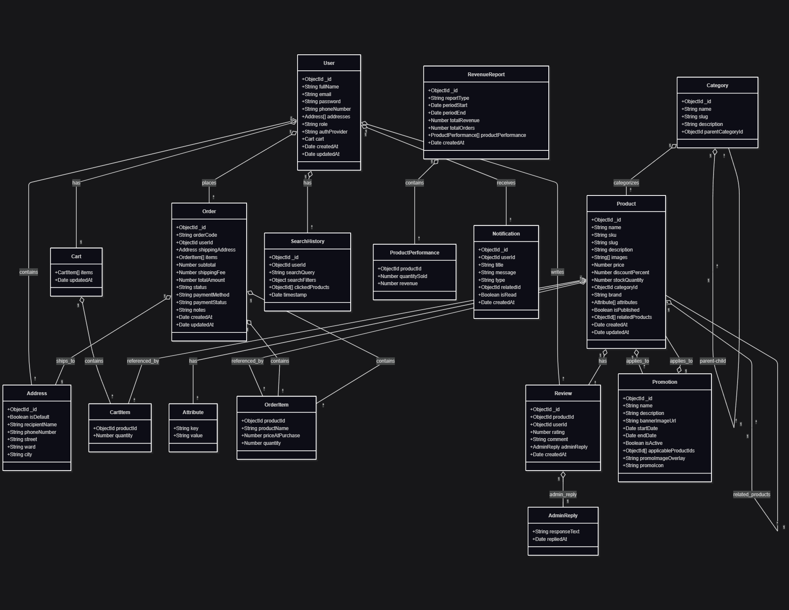

# Mô tả Cơ sở dữ liệu (MongoDB Schema) - Dự án WellVerse (Tên gợi ý)

Tài liệu này mô tả chi tiết cấu trúc các `collection` (tương đương bảng trong SQL) và các `document` (tương đương hàng) trong cơ sở dữ liệu MongoDB của dự án. Thiết kế này ưu tiên sự linh hoạt, hiệu năng đọc và cân bằng giữa việc nhúng dữ liệu (embedding) và tham chiếu (referencing).

# Entity Relationship Diagram (ERD)

## Tổng quan các Collection

1.  **`users`**: Lưu trữ thông tin người dùng và quản trị viên.
2.  **`categories`**: Lưu trữ các danh mục sản phẩm.
3.  **`products`**: Lưu trữ thông tin chi tiết của tất cả sản phẩm.
4.  **`orders`**: Lưu trữ thông tin các đơn hàng của khách hàng.
5.  **`reviews`**: Lưu trữ các đánh giá, phản hồi về sản phẩm.
6.  **`promotions`**: (Dành cho giai đoạn 2) Lưu trữ thông tin các chương trình khuyến mãi.
7.  **`searchHistory`**: Lưu trữ lịch sử tìm kiếm của người dùng.
8.  **`revenueReports`**: Tổng hợp báo cáo doanh thu theo thời gian.
9.  **`notifications`**: Lưu trữ thông báo cho người dùng.

---

## Chi tiết các Collection

### 1. Collection: `users`

**Mô tả:** Chứa thông tin tài khoản, địa chỉ, giỏ hàng và vai trò của người dùng.

| Tên trường (Field Name) | Kiểu dữ liệu (Data Type) | Mô tả                                                                                                      | Ghi chú                                                              |
| :---------------------- | :----------------------- | :--------------------------------------------------------------------------------------------------------- | :------------------------------------------------------------------- |
| `_id`                   | `ObjectId`               | ID duy nhất của document, được MongoDB tự động tạo.                                                        | Khóa chính.                                                          |
| `fullName`              | `String`                 | Họ và tên đầy đủ của người dùng.                                                                           | Bắt buộc.                                                            |
| `email`                 | `String`                 | Địa chỉ email dùng để đăng nhập.                                                                           | Bắt buộc, duy nhất (unique), nên được đánh index.                    |
| `password`              | `String`                 | Mật khẩu của người dùng.                                                                                   | **BẮT BUỘC** phải được hash (ví dụ: bcrypt) trước khi lưu.            |
| `phoneNumber`           | `String`                 | Số điện thoại liên hệ.                                                                                     | Tùy chọn.                                                            |
| `addresses`             | `Array<Object>`          | Mảng chứa các địa chỉ giao hàng của người dùng.                                                            |
| `addresses.isDefault`   | `Boolean`                | `true` nếu đây là địa chỉ mặc định.                                                                        | Chỉ một địa chỉ được `isDefault: true`.                              |
| `addresses.recipientName` | `String`                 | Tên người nhận hàng.                                                                                       |
| `addresses.phoneNumber` | `String`                 | SĐT người nhận.                                                                                            |
| `addresses.street`      | `String`                 | Số nhà, tên đường.                                                                                         |
| `addresses.ward`        | `String`                 | Phường/Xã.                                                                                                 |
| `addresses.city`        | `String`                 | Tỉnh/Thành phố.                                                                                            |
| `role`                  | `String`                 | Vai trò của tài khoản.                                                                                     | Enum: `USER`, `ADMIN`. Mặc định là `USER`.                           |
| `authProvider`          | `String`                 | Nguồn xác thực tài khoản.                                                                                  | Enum: `local`, `google`, `facebook`. Hỗ trợ đăng nhập bên thứ ba.   |
| `cart`                  | `Object`                 | Nhúng giỏ hàng trực tiếp vào người dùng để truy xuất nhanh.                                                 |
| `cart.items`            | `Array<Object>`          | Mảng các sản phẩm trong giỏ hàng.                                                                          |
| `cart.items.productId`  | `ObjectId`               | Tham chiếu đến `_id` của sản phẩm trong collection `products`.                                              |
| `cart.items.quantity`   | `Number`                 | Số lượng của sản phẩm đó trong giỏ.                                                                        |
| `cart.updatedAt`        | `Date`                   | Thời điểm giỏ hàng được cập nhật lần cuối.                                                                  |
| `createdAt`             | `Date`                   | Thời điểm tài khoản được tạo.                                                                              | Tự động tạo.                                                         |
| `updatedAt`             | `Date`                   | Thời điểm tài khoản được cập nhật lần cuối.                                                                | Tự động cập nhật.                                                    |

---

### 2. Collection: `categories`

**Mô tả:** Phân loại sản phẩm thành các danh mục cha-con.

| Tên trường (Field Name) | Kiểu dữ liệu (Data Type) | Mô tả                                                               | Ghi chú                                                          |
| :---------------------- | :----------------------- | :------------------------------------------------------------------ | :--------------------------------------------------------------- |
| `_id`                   | `ObjectId`               | ID duy nhất của danh mục.                                           | Khóa chính.                                                      |
| `name`                  | `String`                 | Tên của danh mục (ví dụ: "Thực phẩm chức năng").                   | Bắt buộc, duy nhất.                                              |
| `slug`                  | `String`                 | Chuỗi định danh thân thiện với URL (ví dụ: "thuc-pham-chuc-nang"). | Bắt buộc, duy nhất, nên được đánh index.                         |
| `description`           | `String`                 | Mô tả ngắn về danh mục.                                             | Tùy chọn.                                                        |
| `parentCategoryId`      | `ObjectId`               | Tham chiếu đến `_id` của danh mục cha trong cùng collection này.    | `null` nếu là danh mục cấp cao nhất.                              |

---

### 3. Collection: `products`

**Mô tả:** Chứa tất cả thông tin liên quan đến một sản phẩm được bán trên trang web.

| Tên trường (Field Name) | Kiểu dữ liệu (Data Type) | Mô tả                                                                                              | Ghi chú                                                                                                    |
| :---------------------- | :----------------------- | :------------------------------------------------------------------------------------------------- | :--------------------------------------------------------------------------------------------------------- |
| `_id`                   | `ObjectId`               | ID duy nhất của sản phẩm.                                                                          | Khóa chính.                                                                                                |
| `name`                  | `String`                 | Tên sản phẩm.                                                                                      | Bắt buộc, nên được đánh index (text index để tìm kiếm).                                                    |
| `sku`                   | `String`                 | Stock Keeping Unit - Mã nội bộ duy nhất để quản lý kho.                                            | Bắt buộc, duy nhất, nên được đánh index.                                                                   |
| `slug`                  | `String`                 | Chuỗi định danh thân thiện với URL.                                                                 | Bắt buộc, duy nhất.                                                                                        |
| `description`           | `String`                 | Mô tả chi tiết về sản phẩm, thành phần, công dụng.                                                  | Bắt buộc.                                                                                                  |
| `images`                | `Array<String>`          | Mảng chứa các URL đến hình ảnh của sản phẩm.                                                        | `images[0]` là ảnh đại diện.                                                                                |
| `price`                 | `Number`                 | Giá gốc của sản phẩm (đơn vị: VND).                                                                | Bắt buộc.                                                                                                  |
| `discountPercent`       | `Number`                 | Tỷ lệ phần trăm giảm giá.                                                                          | Mặc định là `0`. Giá bán cuối cùng = `price * (1 - discountPercent / 100)`.                                |
| `stockQuantity`         | `Number`                 | Số lượng sản phẩm còn lại trong kho.                                                               | Bắt buộc.                                                                                                  |
| `categoryId`            | `ObjectId`               | Tham chiếu đến `_id` của danh mục trong collection `categories`.                                    | Bắt buộc, nên được đánh index để lọc sản phẩm theo danh mục.                                                |
| `brand`                 | `String`                 | Tên thương hiệu/nhà sản xuất.                                                                      | Tùy chọn.                                                                                                  |
| `attributes`            | `Array<Object>`          | Mảng các thuộc tính linh hoạt của sản phẩm.                                                        | Ví dụ: `{ "key": "Xuất xứ", "value": "Việt Nam" }`                                                          |
| `isPublished`           | `Boolean`                | Trạng thái hiển thị sản phẩm trên trang web. `true` = hiển thị.                                    | Mặc định là `true`.                                                                                        |
| `relatedProducts` | `Array<ObjectId>` | Mảng tham chiếu đến các sản phẩm liên quan | Tùy chọn |
| `createdAt`             | `Date`                   | Thời điểm sản phẩm được thêm vào.                                                                  | Tự động tạo.                                                                                               |
| `updatedAt`             | `Date`                   | Thời điểm sản phẩm được cập nhật lần cuối.                                                         | Tự động cập nhật.                                                                                          |

---

### 4. Collection: `orders`

**Mô tả:** Lưu trữ lịch sử các đơn hàng. Dữ liệu quan trọng như địa chỉ và giá sản phẩm được sao chép (nhúng) vào đây để đảm bảo tính toàn vẹn của đơn hàng trong quá khứ.

| Tên trường (Field Name) | Kiểu dữ liệu (Data Type) | Mô tả                                                                                                        | Ghi chú                                                                                                   |
| :---------------------- | :----------------------- | :----------------------------------------------------------------------------------------------------------- | :-------------------------------------------------------------------------------------------------------- |
| `_id`                   | `ObjectId`               | ID duy nhất của đơn hàng.                                                                                    | Khóa chính.                                                                                               |
| `orderCode`             | `String`                 | Mã đơn hàng duy nhất, thân thiện với người dùng (ví dụ: `DH-20231027-001`).                                  | Bắt buộc, duy nhất, nên được đánh index.                                                                  |
| `userId`                | `ObjectId`               | Tham chiếu đến `_id` của người dùng trong collection `users`.                                                 | Bắt buộc, nên được đánh index để tra cứu đơn hàng theo người dùng.                                         |
| `shippingAddress`       | `Object`                 | **Sao chép** địa chỉ giao hàng tại thời điểm đặt hàng.                                                        | Quan trọng: Không tham chiếu để tránh mất dữ liệu khi người dùng thay đổi địa chỉ trong profile của họ. |
| `items`                 | `Array<Object>`          | Mảng các sản phẩm trong đơn hàng.                                                                            |
| `items.productId`       | `ObjectId`               | Tham chiếu đến sản phẩm gốc.                                                                                 |
| `items.productName`     | `String`                 | **Sao chép** tên sản phẩm tại thời điểm mua.                                                                  | Đảm bảo tính nhất quán nếu tên sản phẩm gốc thay đổi.                                                      |
| `items.priceAtPurchase` | `Number`                 | **Sao chép** giá của sản phẩm tại thời điểm mua.                                                              | Đảm bảo tính nhất quán nếu giá sản phẩm gốc thay đổi.                                                      |
| `items.quantity`        | `Number`                 | Số lượng sản phẩm đã mua.                                                                                    |
| `subtotal`              | `Number`                 | Tổng tiền hàng (chưa bao gồm phí vận chuyển).                                                                |
| `shippingFee`           | `Number`                 | Phí vận chuyển.                                                                                              |
| `totalAmount`           | `Number`                 | Tổng số tiền phải thanh toán (`subtotal` + `shippingFee`).                                                   |
| `status`                | `String`                 | Trạng thái của đơn hàng.                                                                                     | Enum: `PENDING`, `PROCESSING`, `SHIPPED`, `COMPLETED`, `CANCELLED`. Nên được đánh index.                 |
| `paymentMethod`         | `String`                 | Phương thức thanh toán.                                                                                      | Enum: `COD`, `MOMO`, `BANK_TRANSFER`.                                                                     |
| `paymentStatus`         | `String`                 | Trạng thái thanh toán.                                                                                       | Enum: `UNPAID`, `PAID`.                                                                                   |
| `notes`                 | `String`                 | Ghi chú của khách hàng cho đơn hàng.                                                                         | Tùy chọn.                                                                                                 |
| `createdAt`             | `Date`                   | Thời điểm đơn hàng được tạo.                                                                                 | Tự động tạo, nên được đánh index để lọc đơn hàng theo thời gian.                                          |
| `updatedAt`             | `Date`                   | Thời điểm trạng thái đơn hàng được cập nhật.                                                                 | Tự động cập nhật.                                                                                         |

---

### 5. Collection: `reviews` (Giai đoạn 2)

**Mô tả:** Lưu trữ các đánh giá và bình luận của người dùng cho từng sản phẩm.

| Tên trường (Field Name) | Kiểu dữ liệu (Data Type) | Mô tả                                                     | Ghi chú                                                            |
| :---------------------- | :----------------------- | :-------------------------------------------------------- | :----------------------------------------------------------------- |
| `_id`                   | `ObjectId`               | ID duy nhất của đánh giá.                                 | Khóa chính.                                                        |
| `productId`             | `ObjectId`               | Tham chiếu đến sản phẩm được đánh giá.                     | Bắt buộc, nên được đánh index để lấy tất cả review của 1 sản phẩm. |
| `userId`                | `ObjectId`               | Tham chiếu đến người dùng đã viết đánh giá.               | Bắt buộc.                                                          |
| `rating`                | `Number`                 | Điểm đánh giá.                                            | Bắt buộc, giá trị từ 1 đến 5.                                      |
| `comment`               | `String`                 | Nội dung bình luận.                                       | Tùy chọn.                                                          |
| `adminReply`            | `Object`                 | Nội dung phản hồi của quản trị viên.                      | Tùy chọn.                                                          |
| `adminReply.responseText` | `String`                 | Nội dung phản hồi.                                        |
| `adminReply.repliedAt`  | `Date`                   | Thời điểm quản trị viên phản hồi.                         |
| `createdAt`             | `Date`                   | Thời điểm đánh giá được tạo.                              | Tự động tạo.                                                       |

---

### 6. Collection: `promotions` (Giai đoạn 2)

**Mô tả:** Quản lý các chương trình khuyến mãi, banner quảng cáo.

| Tên trường (Field Name) | Kiểu dữ liệu (Data Type) | Mô tả                                                                           | Ghi chú                                                 |
| :---------------------- | :----------------------- | :------------------------------------------------------------------------------ | :------------------------------------------------------ |
| `_id`                   | `ObjectId`               | ID duy nhất của chương trình.                                                   | Khóa chính.                                             |
| `name`                  | `String`                 | Tên chương trình khuyến mãi (ví dụ: "Chào hè rực rỡ").                          | Bắt buộc.                                               |
| `description`           | `String`                 | Mô tả chi tiết về chương trình.                                                 | Tùy chọn.                                               |
| `bannerImageUrl`        | `String`                 | URL đến hình ảnh banner quảng cáo cho chương trình.                              |
| `startDate`             | `Date`                   | Ngày bắt đầu chương trình.                                                      | Bắt buộc.                                               |
| `endDate`               | `Date`                   | Ngày kết thúc chương trình.                                                     | Bắt buộc.                                               |
| `isActive`              | `Boolean`                | Trạng thái kích hoạt của chương trình. Admin có thể bật/tắt thủ công.           |
| `applicableProductIds`  | `Array<ObjectId>`        | Danh sách ID sản phẩm được áp dụng khuyến mãi này.                             | Bắt buộc, tham chiếu đến collection `products`.         |
| `promoImageOverlay`     | `String`                 | URL đến overlay image được áp dụng lên sản phẩm khuyến mãi.                     | Tùy chọn.                                               |
| `promoIcon`             | `String`                 | URL đến icon "chú ý" cho sản phẩm khuyến mãi.                                   | Tùy chọn.                                               |

---

### 7. Collection: `searchHistory`

**Mô tả:** Lưu trữ lịch sử tìm kiếm của người dùng để hỗ trợ gợi ý sản phẩm.

| Tên trường (Field Name) | Kiểu dữ liệu (Data Type) | Mô tả                                                                                                      | Ghi chú                                                              |
| :---------------------- | :----------------------- | :--------------------------------------------------------------------------------------------------------- | :------------------------------------------------------------------- |
| `_id`                   | `ObjectId`               | ID duy nhất của bản ghi tìm kiếm.                                                                          | Khóa chính.                                                          |
| `userId`                | `ObjectId`               | Tham chiếu đến người dùng thực hiện tìm kiếm.                                                               | Nên đánh index                                                        |
| `searchQuery`           | `String`                 | Từ khóa đã tìm kiếm.                                                                                       | Nên đánh index                                                        |
| `searchFilters`         | `Object`                 | Các bộ lọc đã áp dụng (category, price range, etc.)                                                        |                                                                     |
| `clickedProducts`       | `Array<ObjectId>`        | Sản phẩm được click sau khi tìm kiếm                                                                         |                                                                     |
| `timestamp`             | `Date`                   | Thời điểm tìm kiếm.                                                                                        | Tự động tạo                                                          |

---

### 8. Collection: `revenueReports`

**Mô tả:** Tổng hợp báo cáo doanh thu theo thời gian.

| Tên trường | Kiểu dữ liệu | Mô tả | Ghi chú |
|:-----------|:-------------|:------|:--------|
| `_id` | `ObjectId` | ID duy nhất của báo cáo | Khóa chính |
| `reportType` | `String` | Loại báo cáo | Enum: `DAILY`, `MONTHLY`, `QUARTERLY` |
| `periodStart` | `Date` | Thời điểm bắt đầu của kỳ báo cáo | |
| `periodEnd` | `Date` | Thời điểm kết thúc của kỳ báo cáo | |
| `totalRevenue` | `Number` | Tổng doanh thu | |
| `totalOrders` | `Number` | Tổng số đơn hàng | |
| `productPerformance` | `Array<Object>` | Hiệu suất các sản phẩm trong kỳ | |
| `productPerformance.productId` | `ObjectId` | Tham chiếu đến sản phẩm | |
| `productPerformance.quantitySold` | `Number` | Số lượng đã bán | |
| `productPerformance.revenue` | `Number` | Doanh thu từ sản phẩm | |
| `createdAt` | `Date` | Thời điểm tạo báo cáo | Tự động tạo |

---

### 9. Collection: `notifications`

**Mô tả:** Lưu trữ thông báo cho người dùng.

| Tên trường | Kiểu dữ liệu | Mô tả | Ghi chú |
|:-----------|:-------------|:------|:--------|
| `_id` | `ObjectId` | ID duy nhất của thông báo | Khóa chính |
| `userId` | `ObjectId` | Tham chiếu đến người dùng nhận thông báo | Nên đánh index |
| `title` | `String` | Tiêu đề thông báo | |
| `message` | `String` | Nội dung thông báo | |
| `type` | `String` | Loại thông báo | Enum: `ORDER_STATUS`, `PROMOTION`, `SYSTEM`, v.v. |
| `relatedId` | `ObjectId` | ID của đối tượng liên quan (đơn hàng, khuyến mãi...) | Tùy chọn |
| `isRead` | `Boolean` | Trạng thái đã đọc | Mặc định: `false` |
| `createdAt` | `Date` | Thời điểm tạo thông báo | Tự động tạo |

## Đề xuất về Indexing (Đánh chỉ mục)

Để đảm bảo hiệu năng truy vấn, các trường sau nên được đánh index:

-   `users`: `email`, `role`
-   `categories`: `slug`
-   `products`: `slug`, `sku`, `categoryId`, `price`, và text index cho `name`
-   `orders`: `orderCode`, `userId`, `status`, `createdAt`
-   `reviews`: `productId`, `userId`
-   `searchHistory`: `userId`, `searchQuery`, `timestamp`
-   `revenueReports`: `reportType`, `periodStart`, `periodEnd`
-   `notifications`: `userId`, `createdAt`